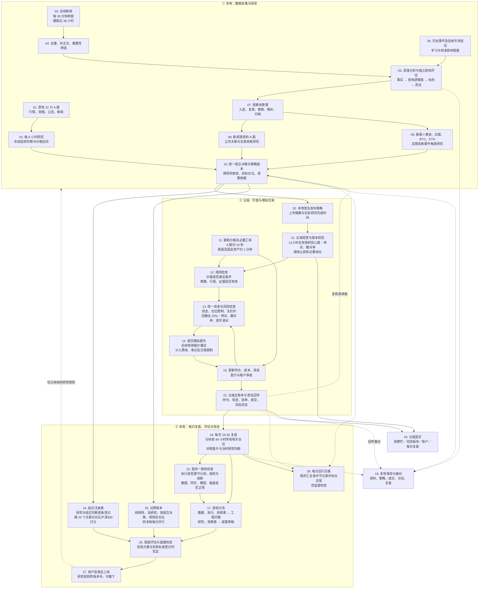

# 当前数据运行流程

核对日期：2026-09-26。依据 0.15.2 实现；所有交易均为模拟交易。

方格编号 01–22 为固定引用编号，可直接在对话中使用，例如“讨论 07 观察池管理”。后续新增节点使用新编号，已有节点不重新编号。

10 在研究批次完成后合并触发，并每小时复核；保留原研究价格条件，发布买入授权、保持、暂停、减仓或退出及目标仓位。13 保持独立硬性风控。

## 当前实现边界

- 原有 22 只 A 股保持原研究路径；新闻发现的 A 股、美股与固定资产使用各自的研究和模拟交易路径。三个执行账本共用账户现金和风险控制。
- 正常观察池上限 40：原有 22 只、固定 4 种，以及最多 14 个动态活跃标的；动态重点研究最多 8 个。持仓及未完成委托必须继续管理，迁移或手动变更造成超额时暂停新增，不直接删除已有风险敞口。
- 固定四种资产为黄金、白银、比特币、以太坊。债券与外汇页面为 coming soon；美元兑人民币汇率仍用于账户折算。
- 原自选 A 股和全球资产交易策略的研究依据通常有效 12 小时；每小时复核组合资格；分离部署后的组合授权最长12小时，不是持仓期限，也不会延长底层研究有效期。新证据或失效条件可提前阻止买入。新闻 A 股另有事件与历史验证门槛。
- 复盘使用前 48 小时的全部相关仓位，包括期间平仓的仓位；没有当日交易也要检查持仓。24 小时收益另算，避免重叠窗口重复累计。
- 历史影响校准与账户复盘是两条学习路径；历史数据不足时保留不确定性。复盘发现不进入研究输入：数据、执行、系统类登记为工程问题，研究、观察类登记为提案草稿；提案经检验、用户批准后才上线，其中研究规则类提案成为研究输入。复盘不直接放宽交易门槛。
- 每条研究计划、组合决策、全球计划和复盘记录都带版本号（`build_id`），由代码、影响判断的设置、模型名称与推理强度设置、已采纳研究规则决定；模型名称在调用时固定（推理强度也可固定，目前未固定），实际运行的模型逐次记录。24 与 25 的日常用法见工作区 `docs/operations/02-研究与交易策略优化.md`。
- 28 每天 23:50 由程序生成，只统计原始记录并按固定规则标出异常，不调用模型、不改变任何状态；读法见工作区 `docs/operations/03-复盘.md`。
- 图中频率为调度目标，实际执行受交易时段、数据可用性和任务队列约束。本机断网时，需要联网的任务等联网后再运行，正在进行的资料研究在下一只股票前停下，联网后补做（0.15.2 起，用户决定现阶段不强依赖准时研究）。当前规则执行模式为 RULES，模型参与研究与复盘，不在每次报价时直接下单。

## 代码对应

| 环节 | 主要模块 |
| --- | --- |
| 调度、任务队列、备份 | `ashare/scheduler.py`、`ashare/workflow.py` |
| 原有 A 股研究 | `ashare/research.py`、`ashare/sources.py` |
| 全球新闻与独立影响评估 | `ashare/dynamic.py`、`ashare/news_triage.py`、`ashare/macro.py`、`ashare/macro_impact.py`、`ashare/impact_history.py` |
| 观察池与固定资产政策 | `ashare/observation_pool.py`、`ashare/investment_policy.py` |
| 全球资产研究与行情 | `ashare/global_research.py`、`ashare/global_market.py` |
| 统一组合判断、版本、目标与授权 | `ashare/portfolio_strategy.py` |
| 本地签名发布、云端验签与主账本回传 | `ashare/cloud_protocol.py`、`ashare/cloud_sync.py`、`ashare/cloud_ledger.py`、`ashare/cloud_runtime.py` |
| 规则执行、撮合、风险 | `ashare/slots.py`、`ashare/paper.py`、`ashare/dynamic_paper.py`、`ashare/global_paper.py`、`ashare/plan_recheck.py`、`ashare/portfolio_risk.py` |
| 全仓复盘及展示 | `ashare/review.py`、`ashare/review_portfolio.py`、`ashare/review_analysis.py`、`ashare/review_checks.py`、`ashare/dashboard.py` |
| 发现分流、提案、已采纳研究规则 | `ashare/governance.py` |
| 结论注册表、对照账本、周报、离线回测 | `ashare/evaluation.py`、`ashare/shadow.py`、`ashare/weekly.py`、`ashare/backtest.py` |
| 版本号与固定模型调用 | `ashare/build.py`、`ashare/model.py` |
| 发布包清理、备份保留、磁盘检查 | `ashare/maintenance.py` |
| 每日运行日报与区间汇总 | `ashare/digest.py` |
| 断网判断，离线与停顿记录 | `ashare/connectivity.py` |
